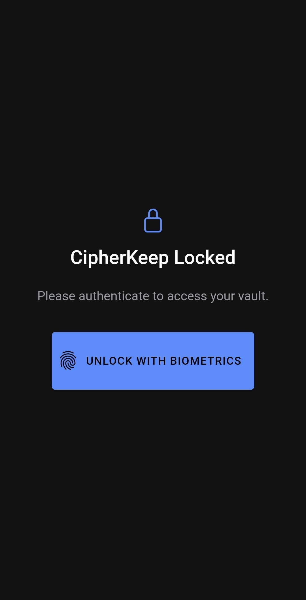
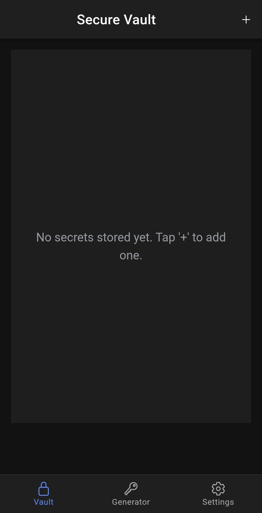
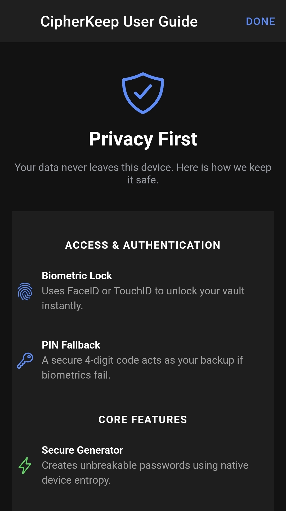
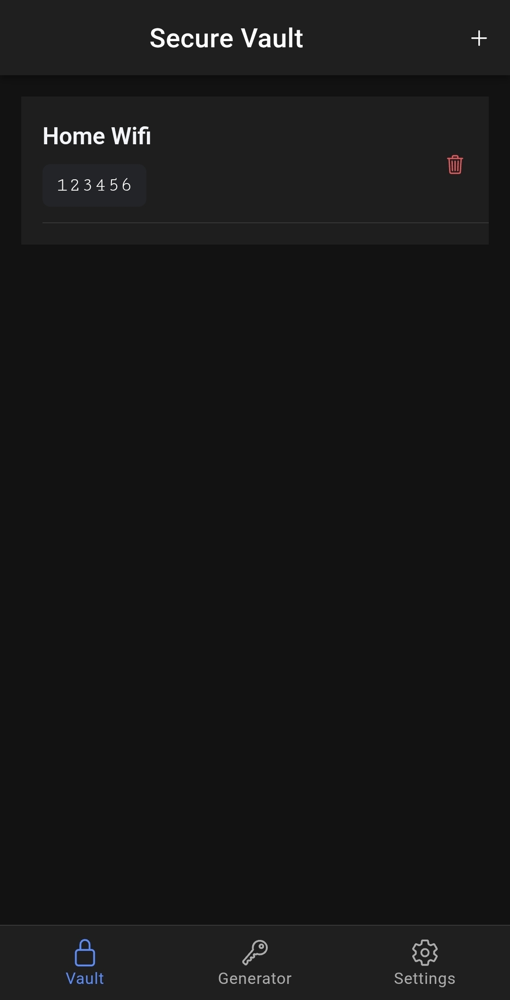
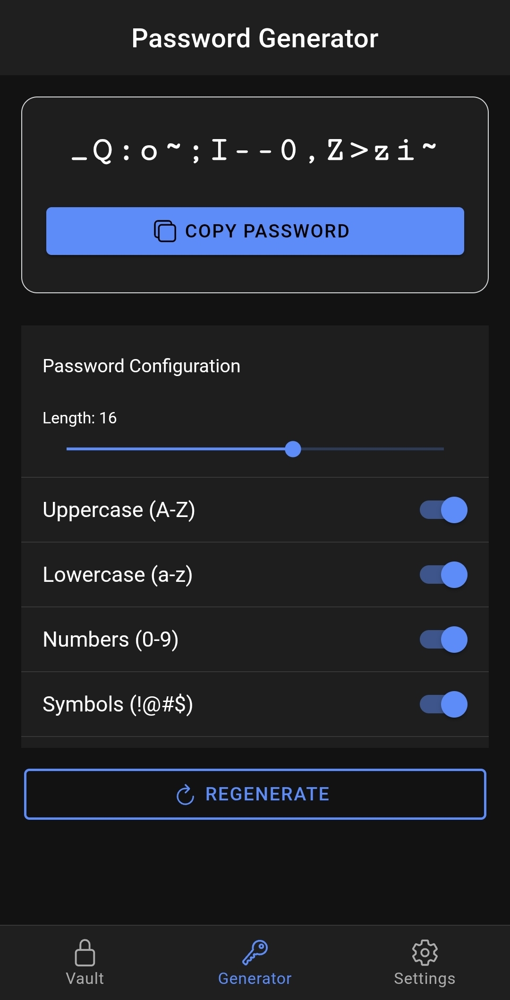
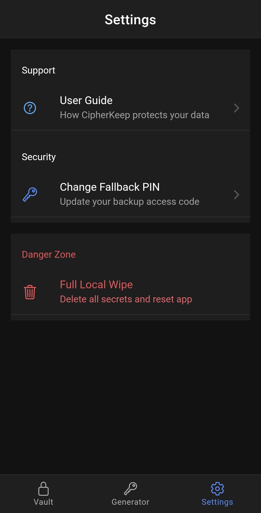

# CipherKeep: Secure Biometric Vault

CipherKeep is a locally secured mobile application for storing sensitive text secrets. Unlike standard note-taking apps that rely on insecure localStorage, CipherKeep implements a hardware-backed security architecture to ensure data remains encrypted and inaccessible without biometric verification.

## 🏗 Tech Stack & Architecture

* **Frontend:** Architected entirely with Angular 17 Standalone Components for a modular, tree-shakeable codebase.
* **State Management:** Angular Signals manage the global `isAuthenticated` state, providing a highly reactive and clean alternative to complex RxJS BehaviorSubjects.
* **Biometric Security Integration:** Integrates `@aparajita/capacitor-biometric-auth` to interface directly with iOS FaceID/TouchID and Android Biometrics.
* **Hardware-Backed Security Encryption:** Utilizes `capacitor-secure-storage-plugin` to ensure all vaulted data is hardware-encrypted via the native OS security layers (iOS Keychain / Android Keystore) rather than vulnerable `localStorage`.

## 🛡️ Security Features & Edge Case Handling

A major focus of this project is resilient error handling and graceful degradation:

* **Fallback Authentication:** Implements a native PIN fallback system via Capacitor Preferences if biometric hardware is missing, disabled, or encounters permission denials.
* **Corrupted Data Protection:** Wraps all keystore read/write operations in robust `try/catch` blocks. If decryption fails due to corrupted keychain data, the app alerts the user gracefully without crashing.
* **Route Protection:** A functional Angular 17 Route Guard   intercepts unauthorized navigation attempts to the internal tabs, ensuring the vault remains locked.

## 🧠 Technical Challenges & Solutions

### 1. Synchronizing Native Biometrics with Angular Signals

  **The Challenge:** Interfacing asynchronous native hardware calls from `@aparajita/capacitor-biometric-auth` with Angular’s synchronous Signal-based state management.
  **The Solution:** Engineered a custom `AuthService` that wraps native promises.  By utilizing a private `WritableSignal` and exposing a `computed` read-only Signal, I ensured the UI reactively updates across all tabs the moment the native hardware confirms a match.

### 2. Graceful Degradation & Hardware Absence

  **The Challenge:** Handling scenarios where a device lacks biometric hardware or the user denies permissions, which often causes mobile apps to hang or crash.
  **The Solution:** Implemented a robust "Fallback Logic" engine.  Using `try/catch` blocks around the `isAvailable` checks, the app detects hardware failures and automatically triggers an Ionic `AlertController` to switch the user to the secure PIN override stored in `Capacitor Preferences`.

### 3. Cryptographically Secure Randomness in a Web Environment

  **The Challenge:** Standard JavaScript `Math.random()` is mathematically predictable and unsuitable for a high-security vault
  **The Solution:** Switched to the **Web Cryptography API** (`window.crypto.getRandomValues`).  This ensures that the generated passwords leverage native device entropy, providing a CSPRNG (Cryptographically Secure Pseudorandom Number Generator) that meets industry security standards.

## ✨ Recent Feature Additions (Phase 2)

* **Cryptographically Secure Generation (Offline):** A utility tab featuring a secure, offline password generator. It utilizes the Web Cryptography API (`window.crypto.getRandomValues`) for client-side unpredictability.
* **Clipboarntegration:** Integrate `@capacitor/clipboard` for easy copying of generated passwords natively.
* **Settings & PIN Management:** Implement logic to update the fallback PIN directly through the device's preferences.
* **The "Nuke" Feature (Full Local Wipe):** A critical security implementation in the Settings tab allows users to execute a Full Wipe. This destroys all secrets in the hardware keystore and clears local preferences, effectively resetting the app to a "zero-knowledge" state.
  
## 📱 Application Preview

| Lock Screen | Vault UI | Onboarding Screen |
| :---: | :---: | :---: |
|  |  |  |

| Vault Screen | Password Generator | Settings Scren |
| :---: | :---: | :---: |
|  |  |  |

## 🚀 Getting Started

Prerequisites
Ionic CLI: npm install -g @ionic/cli

Native Platforms: Xcode (iOS) or Android Studio (Android) are required for biometric testing.

Installation

* **Clone and install dependencies**

git clone 'project_ssh/http_url'

cd Cipherkeep

npm install

* **Run in browser (Note: Biometrics require a physical device)**

ionic serve

* **Sync to native platforms**

npx cap sync
npx cap open ios  # or android
